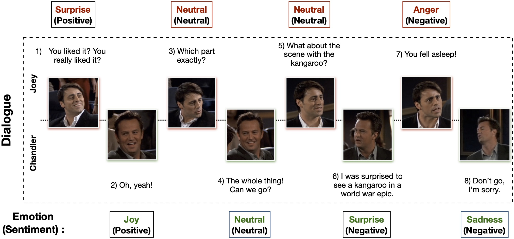

# awesome-emotion-recognition-in-conversations
A comprehensive reading list for papers related to **Emotion Recognition in Conversations (ERC), contextual Sentiment/Affect/Sarcasm Analysis, or joint classification of pragmatics such as Dialogue Acts in Conversations**.

**_Please feel free to send a PR in case any new or existing paper is missing from the list._**

## What is ERC?

ERC is a task that aims at predicting emotion of each utterance in a conversation. The following is an excerpt of a conversation with each utterance tagged with corresponding emotion and sentiment label:

  

## Overviews

- [Beneath the Tip of the Iceberg: Current Challenges and New Directions in Sentiment Analysis Research](https://ieeexplore.ieee.org/document/9260964), IEEE Transactions on Affective Computing 2020
- [Emotion Recognition in Conversation: Research Challenges, Datasets, and Recent Advances](https://ieeexplore.ieee.org/document/8764449), IEEE Access 2019

## Data Resources

- [MEISD: A Multimodal Multi-Label Emotion, Intensity and Sentiment Dialogue Dataset for Emotion Recognition and Sentiment Analysis in Conversations
](https://www.aclweb.org/anthology/2020.coling-main.393.pdf), COLING 2020
- [Storytelling with Dialogue: A Critical Role Dungeons and Dragons Dataset](https://www.aclweb.org/anthology/2020.acl-main.459.pdf), ACL 2020
- [ScenarioSA: A Dyadic Conversational Database for Interactive Sentiment Analysis](https://ieeexplore.ieee.org/iel7/6287639/8948470/09091843.pdf), IEEE Access 2020
- [K-EmoCon, a multimodal sensor dataset for continuous emotion recognition in naturalistic conversations](https://arxiv.org/pdf/2005.04120.pdf), Arxiv 2020
- [Emotional Dialogue Acts](https://www.aclweb.org/anthology/2020.lrec-1.78.pdf), LREC 2020
- [MELD: A Multimodal Multi-Party Dataset for Emotion Recognition in Conversations](https://www.aclweb.org/anthology/P19-1050.pdf), ACL 2019
- [MUStARD: Towards Multimodal Sarcasm Detection (An Obviously Perfect Paper)](https://www.aclweb.org/anthology/P19-1455.pdf), ACL 2019
- [Understanding emotions in text using deep learning and big data](https://www.sciencedirect.com/science/article/pii/S0747563218306150), Computers in Human Behavior 2019
- [Emotionlines: An emotion corpus of multi-party conversations](https://www.aclweb.org/anthology/L18-1252.pdf), LREC 2018
- [DailyDialog: A Manually Labelled Multi-turn Dialogue Dataset](https://www.aclweb.org/anthology/I17-1099.pdf), AFNLP 2017
- [The semaine database: Annotated multimodal records of emotionally colored conversations between a person and a limited agent](https://semaine-db.eu), IEEE Transactions on Affective Computing 2012
- [IEMOCAP: Interactive emotional dyadic motion capture database](https://sail.usc.edu/iemocap/), JLRE 2008

## ERC

- [Modeling both Intra- and Inter-modal Influence for Real-Time Emotion Detection in Conversations](https://dl.acm.org/doi/pdf/10.1145/3394171.3413949?casa_token=CgDjp2hokAEAAAAA:W-GCXBkMztp74bOyjSDQQM0dmeNOU-XKhN336SmJBT_rbhX0PAv5JGSVq_0yD8LU3DNb7uyqPoQk), ACM MM 2020 
- [Contextual Augmentation of Pretrained Language Models for Emotion Recognition in Conversations](https://www.aclweb.org/anthology/2020.peoples-1.7.pdf), COLING 2020
- [CAN-GRU: a Hierarchical Model for Emotion Recognition in Dialogue](https://www.aclweb.org/anthology/2020.ccl-1.102.pdf), COLING 2020
- [DialogueTRM: Exploring the Intra- and Inter-Modal Emotional Behaviors in the Conversation](https://arxiv.org/pdf/2010.07637.pdf), Arxiv 2020
- [Knowledge Aware Emotion Recognition in Textual Conversations via Multi-Task Incremental Transformer](https://www.aclweb.org/anthology/2020.coling-main.392.pdf), COLING 2020
- [Summarize before Aggregate: A Global-to-local Heterogeneous Graph Inference Network for Conversational Emotion Recognition](https://www.aclweb.org/anthology/2020.coling-main.367.pdf), COLING 2020
- [An Iterative Emotion Interaction Network for Emotion Recognition in Conversations](https://www.aclweb.org/anthology/2020.coling-main.360.pdf), COLING 2020
- [HiTrans: A Transformer-Based Context- and Speaker-Sensitive Model for Emotion Detection in Conversations](https://www.aclweb.org/anthology/2020.coling-main.370.pdf), COLING 2020
- [Relation-aware Graph Attention Networks with Relational Position Encodings for Emotion Recognition in Conversations], EMNLP 2020
- [HAN-ReGRU: hierarchical attention network with residual gated recurrent unit for emotion recognition in conversation](https://link.springer.com/article/10.1007/s00521-020-05063-7), Neural Computing Applications 2020
- [Real-Time Emotion Recognition via Attention Gated Hierarchical Memory Network](https://arxiv.org/pdf/1911.09075.pdf), AAAI 2020
- [Adapted Dynamic Memory Network for Emotion Recognition in Conversation](https://ieeexplore.ieee.org/abstract/document/9128015), IEEE Transactions on Affective Computing 2020
- [Different Contextual Window Sizes Based RNNs for Multimodal Emotion Detection
in Interactive Conversations](https://ieeexplore.ieee.org/stamp/stamp.jsp?tp=&arnumber=9127905), IEEE Access 2020 
- [Domain adversarial learning for emotion recognition](https://arxiv.org/pdf/1910.13807.pdf), Arxiv 2020
- [Towards Emotion-aided Multi-modal Dialogue Act Classification](https://www.aclweb.org/anthology/2020.acl-main.402.pdf), ACL 2020
- [A Self-Attentive Emotion Recognition Network](https://ieeexplore.ieee.org/stamp/stamp.jsp?arnumber=9054762), ICASSP 2020
- [Hierarchical Transformer Network for Utterance-Level Emotion Recognition](https://www.mdpi.com/2076-3417/10/13/4447/pdf), Applied Sciences 2020
- [Exploring Perception Uncertainty for Emotion Recognition in Dyadic Conversation and Music Listening](https://link.springer.com/content/pdf/10.1007/s12559-019-09694-4.pdf), Springer 2020
- [A Novel Semantic Approach for Intelligent Response Generation using Emotion Detection Incorporating NPMI Measure](https://www.sciencedirect.com/science/article/pii/S1877050920307869), Procedia Computer Science, 2020
- [HGFM: A Hierarchical Grained and Feature Model for Acoustic Emotion Recognition](https://ieeexplore.ieee.org/document/9053039), ICASSP 2020
- [A Dialogical Emotion Decoder for Speech Motion Recognition in Spoken Dialog](https://ieeexplore.ieee.org/document/9053561), ICASSP 2020
- [Adapted Dynamic Memory Network for Emotion Recognition in Conversation](https://ieeexplore.ieee.org/document/9128015/), IEEE Transaction on Affective Computing 2020
- [Contextualized Emotion Recognition in Conversation as Sequence Tagging](https://www.sigdial.org/files/workshops/conference21/pdf/2020.sigdial-1.23.pdf), SIGDIAL 2020
- [Different Contextual Window Sizes based RNNs for Multimodal Emotion Detection in Interactive Conversations](https://ieeexplore.ieee.org/abstract/document/9127905/), IEEE Access 2020
- [Retrospective Loss: Looking Back to Improve Training of Deep Neural Networks](https://arxiv.org/pdf/2006.13593), KDD 2020
- [Attention-based modeling for emotion detection and classification in textual conversations](https://arxiv.org/pdf/1906.07020), Arxiv 2020
- [BiERU: Bidirectional Emotional Recurrent Unit for Conversational Sentiment Analysis](https://arxiv.org/pdf/2006.00492.pdf), Arxiv 2020
- [Multi-Task Learning with Auxiliary Speaker Identification for Conversational Emotion Recognition](https://arxiv.org/pdf/2003.01478.pdf), Arxiv 2020
- [Analysis of Utterance Combinations for Emotion Recognition in Conversation](https://www.jstage.jst.go.jp/article/pjsai/JSAI2020/0/JSAI2020_3F5ES201/_pdf), Unpublished
- [Interactive double states emotion cell model for textual dialogue emotion prediction](https://www.sciencedirect.com/science/article/abs/pii/S0950705119304654), KBS 2020
- [Contextualized Emotion Recognition in Conversation as Sequence Tagging](https://www.sigdial.org/files/workshops/conference21/pdf/2020.sigdial-1.23.pdf), SIGDIAL 2020
- [Non-acted multi-view audio-visual dyadic interactions. Project non-verbal emotion recognition in dyadic scenarios and speaker segmentation](http://diposit.ub.edu/dspace/bitstream/2445/159557/2/159557.pdf), Masters/Doctoral Thesis 2020
- [Multilogue-Net: A Context Aware RNN for Multi-modal Emotion Detection and Sentiment Analysis in Conversation](https://www.aclweb.org/anthology/2020.challengehml-1.3.pdf), HML Workshop, ACL 2020
- [Conversational Transfer Learning for Emotion Recognition](https://arxiv.org/abs/1910.04980), INFFUS 2020
- [An interaction-aware attention network for speech emotion recognition in spoken dialogs](https://ieeexplore.ieee.org/document/8683293/), ICASSP 2019
- [Higru: Hierarchical gated recurrent units for utterance-level emotion recognition](https://www.aclweb.org/anthology/N19-1037.pdf), NAACL 2019
- [Detecting Topic-Oriented Speaker Stance in Conversational Speech](https://researchmgt.monash.edu/ws/portalfiles/portal/289322527/289321078_oa.pdf), Interspeech 2019
- [Mutual Correlation Attentive Factors in Dyadic Fusion Networks for Speech Emotion Recognition](https://dl.acm.org/doi/pdf/10.1145/3343031.3351039), ACM MM 2019
- [An Effective Deep Learning Approach for Dialogue Emotion Recognition in Car-Hailing Platform](https://ieeexplore.ieee.org/abstract/document/9060306/), IEEE SmartWorld/SCALCOM/UIC/ATC/CBDCom/IOP/SCI 2019
- [LIRMM-advanse at SemEval-2019 Task 3: Attentive conversation modeling for emotion detection and classification](https://hal-lirmm.ccsd.cnrs.fr/lirmm-02145395/file/semeval2019-proceedings.pdf), Semeval 2019 Task 3
- [ntuer at semeval-2019 task 3: Emotion classification with word and sentence representations in rcnn](https://arxiv.org/pdf/1902.07867.pdf), Semeval 2019 Task 3
- [Coastal at semeval-2019 task 3: Affect classification in dialogue using attentive bilstms](https://www.aclweb.org/anthology/S19-2026.pdf), Semeval 2019 Task 3
- [EPITA-ADAPT at SemEval-2019 Task 3: Detecting emotions in textual conversations using deep learning models combination](https://www.aclweb.org/anthology/S19-2035.pdf), Semeval 2019 Task 3.
- [Modeling both Context-and Speaker-Sensitive Dependence for Emotion Detection in Multi-speaker Conversations](https://www.ijcai.org/Proceedings/2019/0752.pdf), IJCAI 2019
- [What a Dialogue! A Deep Neural Framework for Contextual Affect Detection](https://arxiv.org/pdf/2001.10169.pdf), ICNIP 2019
- [Attentional Neural Network for Emotion Detection in Conversations with Speaker Influence Awareness](http://tcci.ccf.org.cn/conference/2019_1007/papers/230.pdf), CCF International Conference on Natural Language Processing and Chinese Computing 2019
- [Knowledge-Enriched Transformer for Emotion Detection in Textual Conversations](https://www.aclweb.org/anthology/D19-1016.pdf), EMNLP 2019
- [PT-CoDE: Pre-trained Context-Dependent Encoder for Utterance-level Emotion Recognition](https://arxiv.org/abs/1910.08916), Arxiv 2019
- [EmotionX-IDEA: Emotion BERT – an Affectional Model for Conversation](https://arxiv.org/pdf/1908.06264.pdf), Arxiv 2019
- [DialogueGCN: A Graph Convolutional Neural Network for Emotion Recognition in Conversation](https://www.aclweb.org/anthology/D19-1015.pdf), EMNLP 2019
- [DialogueRNN: An Attentive RNN for Emotion Detection in Conversations](https://www.aaai.org/ojs/index.php/AAAI/article/view/4657), AAAI 2019
- [ICON: Interactive Conversational Memory Network for Multimodal Emotion Detection](https://www.aclweb.org/anthology/D18-1280.pdf), EMNLP 2018
- [Conversational Memory Network for Emotion Recognition in Dyadic Dialogue Videos](https://www.aclweb.org/anthology/N18-1193.pdf), NAACL 2018

## Contextual Sentiment Analysis

- [Sentiment Forecasting in Dialog](https://www.aclweb.org/anthology/2020.coling-main.221.pdf), COLING 2020
- [DCR-Net: A Deep Co-Interactive Relation Network for Joint Dialog Act Recognition and Sentiment Classification](https://www.aaai.org/Papers/AAAI/2020GB/AAAI-QinL.5400.pdf), AAAI 2020
- [A Quantum-like Multimodal Network Framework for Modeling Interaction Dynamics in Multiparty Conversational Sentiment Analysis](https://www.sciencedirect.com/science/article/pii/S1566253520302554?casa_token=hvT7DkxejAEAAAAA:1ulmt0sDPWNhhVpG2smXpseF6E_UVoK_IqlLH4Puohq6bNQcuFObP4Vy7GYYg_byr5Yttx1HO2zB), Information Fusion 2020
- [Quantum-Inspired Interactive Networks for Conversational Sentiment Analysis](https://oro.open.ac.uk/61755/1/QIN.pdf), IJCAI 2019
- [Quantum-Inspired DMATT-BiGRU for Conversational Sentiment Analysis](https://ieeexplore.ieee.org/stamp/stamp.jsp?arnumber=8995180), ICTAI 2019

## Contexutal Sarcasm Analysis

- [Reactive Supervision: A New Method for Collecting Sarcasm Data](https://www.aclweb.org/anthology/2020.emnlp-main.201.pdf), EMNLP 2020
- [Sarcasm Detection Using an Ensemble Approach](https://www.aclweb.org/anthology/2020.figlang-1.36.pdf), FigLang, ACL 2020
- [Sarcasm Detection using Context Separators in Online Discourse](https://www.aclweb.org/anthology/2020.figlang-1.6.pdf), FigLang, ACL 2020
- [C-Net: Contextual Network for Sarcasm Detection](https://www.aclweb.org/anthology/2020.figlang-1.8.pdf), FigLang, ACL 2020
- [Sarcasm Identification and Detection in Conversion Context using BERT](https://www.aclweb.org/anthology/2020.figlang-1.10.pdf), FigLang, ACL 2020
- [Applying Transformers and Aspect-based Sentiment Analysis approaches on Sarcasm Detection](https://www.aclweb.org/anthology/2020.figlang-1.9.pdf), FigLang, ACL 2020
- [Neural Sarcasm Detection using Conversation Context](https://www.aclweb.org/anthology/2020.figlang-1.11.pdf), FigLang, ACL 2020
- [Context-Aware Sarcasm Detection Using BERT](https://www.aclweb.org/anthology/2020.figlang-1.12.pdf), FigLang, ACL 2020
- [Transformers on Sarcasm Detection with Context](https://www.aclweb.org/anthology/2020.figlang-1.13.pdf), FigLang, ACL 2020
- [A Novel Hierarchical BERT Architecture for Sarcasm Detection](https://www.aclweb.org/anthology/2020.figlang-1.14.pdf), FigLang, ACL 2020
- [Detecting Sarcasm in Conversation Context Using Transformer-Based Models](https://www.aclweb.org/anthology/2020.figlang-1.15.pdf), FigLang, ACL 2020
- [MUStARD: Towards Multimodal Sarcasm Detection (An Obviously Perfect Paper)](https://www.aclweb.org/anthology/P19-1455.pdf), ACL 2019

## Others

- [Smile Intensity Detection in Multiparty Interaction using Deep Learning](http://www.cristinasegalin.com/research/papers/ACII19.pdf), ACII 2019

## Workshops and Shared Tasks

- [Second Grand-Challenge and Workshop on Multimodal Language (Challenge-HML)](https://www.aclweb.org/anthology/volumes/2020.challengehml-1/), ACL 2020
- [The Second Workshop on Figurative Language Processing](https://sites.google.com/view/figlang2020/), ACL 2020
- [EMOCONTEXT](https://www.humanizing-ai.com/emocontext.html), Semeval 2019
- [EmotionX Challenge](https://sites.google.com/view/emotionx2019), IJCAI 2019

